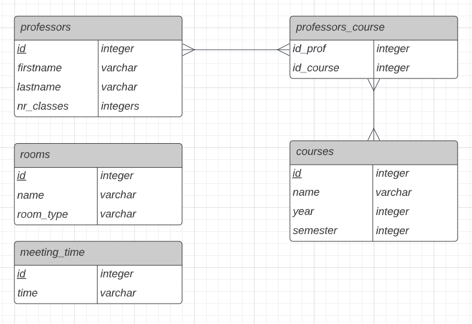
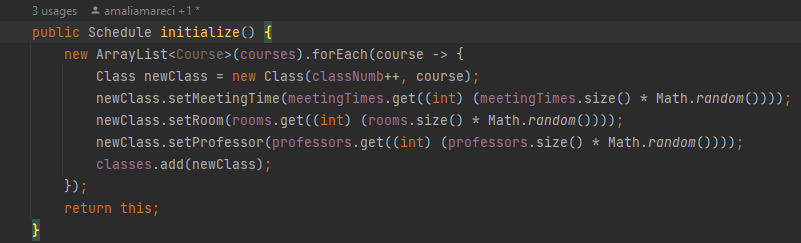
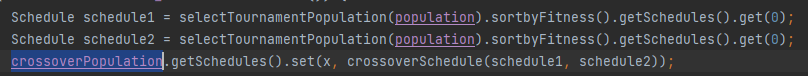
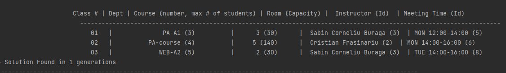

UniversityResources: Evidenta salilor/resurselor unei universitati [Repartizarea eficienta a evenimentelor din orar]


As sugera urmatoarele:

- [x] springboot + spring data + hibernate: cateva clase model relationate (OneToOne si OneToMany)
- [x] operatii CRUD pe modele
- atentie la api-urile REST sa respecte best practices(sunt mai multe articole pe google si unele sunt scrise in curs)
- [x] DB relational (sql, postgres sau altul)
- [x] proiectul sa contina un algoritm ceva mai complex (o intersectie customizata de entitati sau ceva) pentru care sa fie scrise mai multe unit teste care sa acopere toate cazurile
    - aici as vrea sa vad si un code coverage al metodei testate(se poate scoate din intellij)
- [x] integrare cu swagger (este annotation din spring)

Acum trecem la partea de infrastructura:
- [x] un pipeline care face build + deploy in cloud (Heroku)


<br>
<br>



```postgresql
CREATE TABLE courses (
     id serial primary key,
     name varchar,
     max_number_of_students integer
);

CREATE TABLE professors (
    id serial primary key,
    name varchar
);

CREATE TABLE courses_professors (
   professors_id integer,
   course_id integer,
   CONSTRAINT fk_courses FOREIGN KEY(course_id) REFERENCES courses(id) ON DELETE CASCADE,
   CONSTRAINT fk_professors FOREIGN KEY(professors_id) REFERENCES professors(id) ON DELETE CASCADE
);

CREATE TABLE rooms (
   id serial primary key,
   name varchar,
   seating_capacity integer
);
CREATE TABLE meeting_time (
  id serial primary key,
  time varchar
);
```


In rezolvarea acestei probleme ne-am folosit de un algoritm genetic . 

Iddea de baza a unui algoritm genetic consta in a incepe cu o populatie de solutii , fiecare mai performanta decat precedentele.

Fazele ciclului prin care opereaza un asemenea algoritm sunt:

1. crearea unei populatii de membri(solutii candidat la rezolvarea unei probleme)
2. selectia membrilor care s-au adaptat cel mai bine necesitatilor problemei de rezolvat
3. reproducerea (se folosesc operatorii genetici de incrutisare si mutatie, pentru a obtine noi membri)
4. evaluarea gradului in care noii membri corespund mai bine solutionarii problemei 
5. abandonarea populatiei vechi prin inlocuirea ei cu populatia noua din noua generatie

Un asemenea ciclu se repeta pana cand este identificata cea mai buna solutie la problema in cauza.
<hr>
In programul nostru , se retin in niste liste in clasa Timetable resursele din baza de date pe care le luam cu ajutorul unor requesturi.

Apoi se instantiaza cate un obiect GeneticAlgorithm si Population. In Population se realizeaza initializarea random a primei populatii in metoda initialize din clasa Schedule: 



Pentru fiecare schedule dintr-o populatie se calculeaza fitness (repezentand numarul de conflicte pe care le are orarul respectiv: profesori nepotrivit pentru materie , suprapuneri la camera sau interval orar , capacitatea camerei mai mica decat numarul de participanti la curs/laborator)

In clasa GeneticAlgorithm avem metodele specifice algoritmilor genetici : mutatia ,crossoverul ,TournamentPopulation.

Se realizeaza atat timp cat nu gasim un schedule cu fitness=1(fara conflicte) cate 
o mutatie a populatiei ,folosindu-ne de crossover pentru a incrutisa variantele 
curente obinand astfel noi copii . Apoi prin metoda Tournament se aleg din generatia 
curenta primii doi cei mai perfomanti (cu cel mai mare fitness) dupa care sa se 
faca urmatoarea generatie:



In cazul in care se gaseste un schedule fara conflicte atunci am gasit solutia :



Swaggerul:
https://proiect-pa-orar.herokuapp.com/swagger-ui/index.html#/

Link Heroku:
https://proiect-pa-orar.herokuapp.com/timetable
